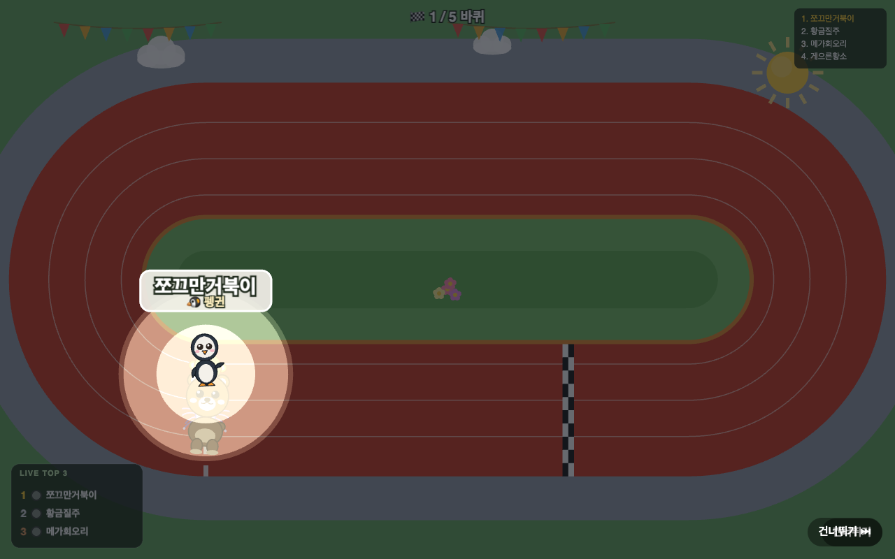
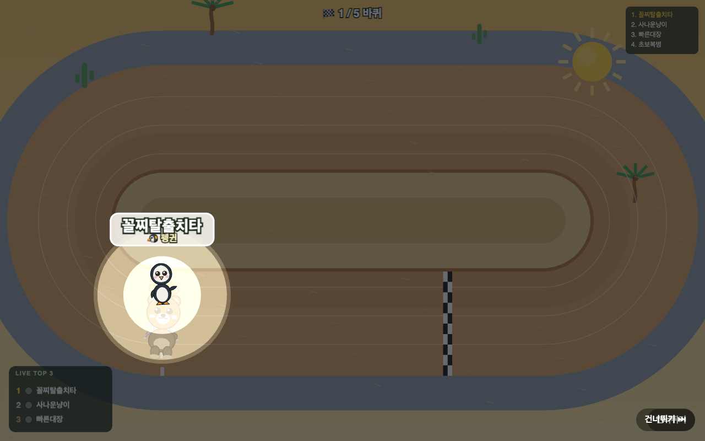
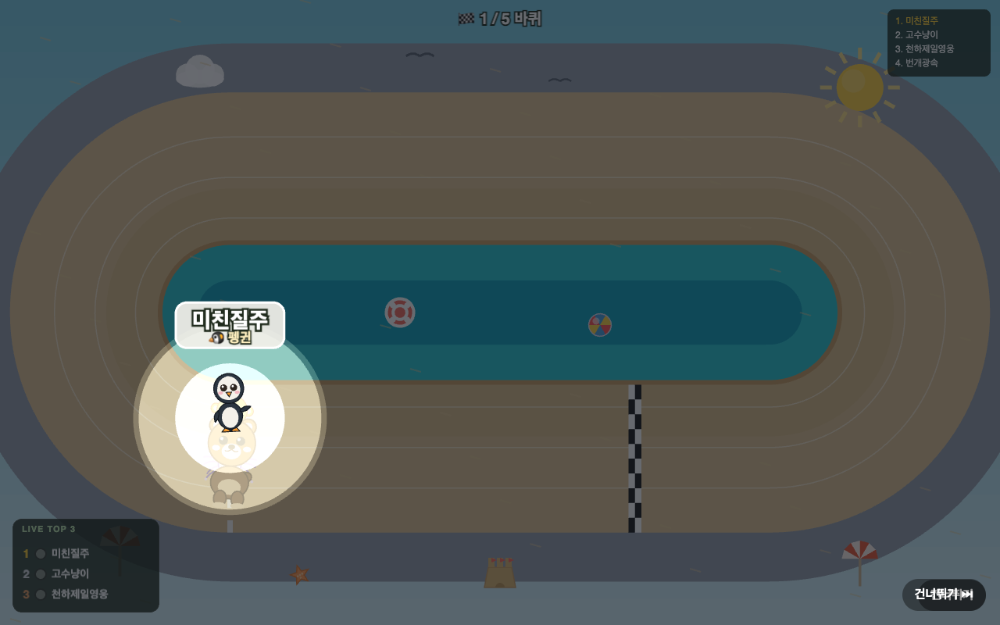
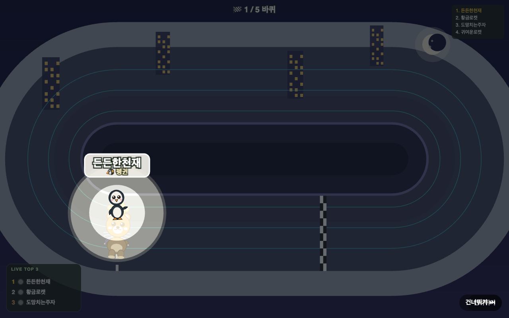
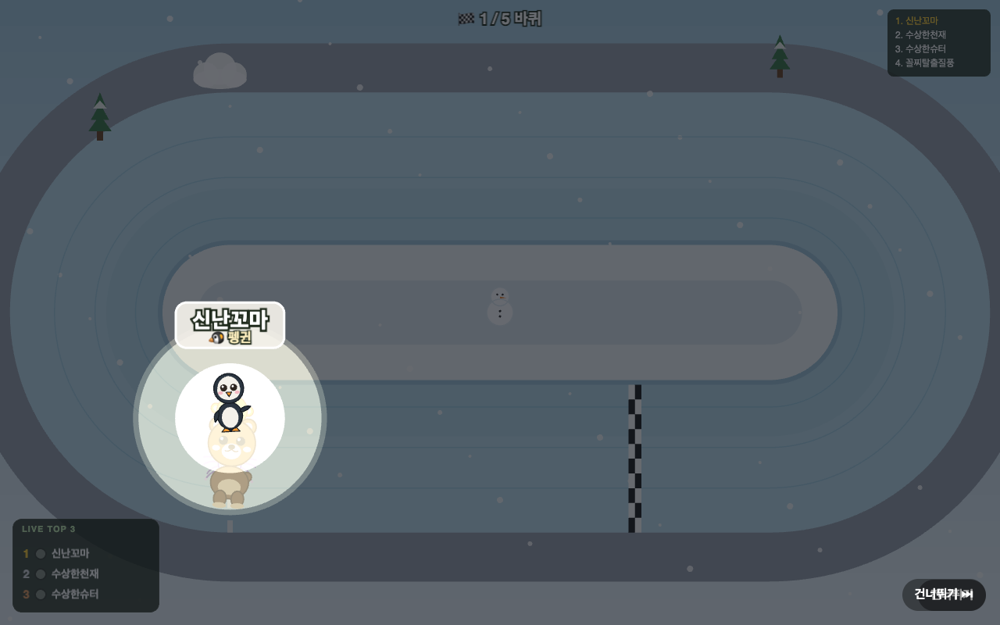
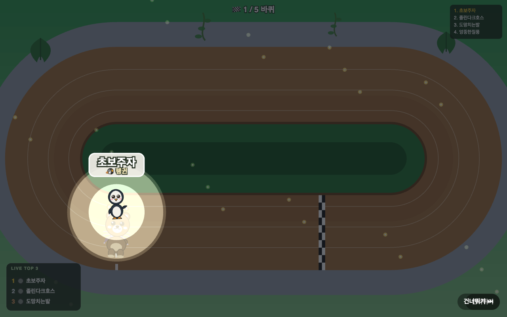

# 🏟️ 우다다 경기장 가이드

총 **6 가지 테마**의 원형 트랙에서 경주가 펼쳐집니다. 트랙 모양은 경주 결과에 영향을 주지 않으며, 순수하게 비주얼만 다릅니다.

---

## 🌿 Grassland (초원)

**기본 맵**. 푸른 잔디와 맑은 하늘이広がる 편안한 초원 트랙.

- **분위기**: 밝고 경쾌한 봄날의 오후
- **특징**: 깔끔한 디자인으로 캐릭터가 가장 잘 보이는 맵

---

## 🏜️ Desert (사막)

황량한 사막 한가운데 자리한 트랙. 뜨거운 태양 아래 모래바람이 불어옵니다.

- **분위기**: 건조하고 뜨거운 사막의 낮
- **특징**: 주황색 모래와 파란 하늘의 대비가 뚜렷함

---

## 🏖️ Beach (해변)

바다 옆 모래사장에 만들어진 트랙. 파도 소리가 배경음으로 들립니다.

- **분위기**: 시원한 바다와 따뜻한 모래
- **특징**: 청록색 바다와 노란 모래의 밝은 컬러 조합

---

## 🌃 Citynight (야간 도시)

밤의 도시 한복판, 네온사인이 빛나는 트랙.

- **분위기**: 어두운 밤도시, 네온사인의 화려함
- **특징**: 어두운 배경에 캐릭터가 더 잘 보이는 대비

---

## ❄️ Snow (설원)

눈 덮인 설원의 트랙. 차가운 바람이 불어옵니다.

- **분위기**: 차가운 겨울, 하얀 눈 세상
- **특징**: 밝은 흰색 배경, 캐릭터 색상이 선명하게 드러남

---

## 🌴 Jungle (정글)

울창한 정글 한가운데 자리한 트랙. 열대 식물들이 우거져 있습니다.

- **분위기**: 습하고 무더운 열대 우림
- **특징**: 짙은 녹색 배경, 야생적인 분위기

---

*모든 맵은 경주 결과에 영향을 주지 않습니다. 단순히 좋아하는 분위기를 선택하세요!*
