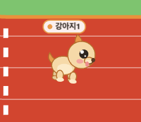
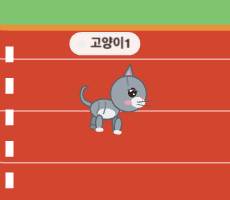
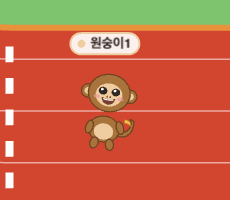
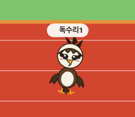
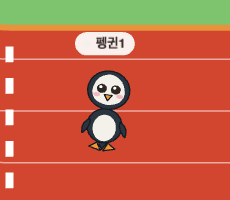
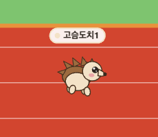

# 🐾 우다다 캐릭터 가이드

귀여운 동물들이 원형 트랙을 달려 순위를 정하는 경주 추첨 게임!
누가 1등 할지는 아무도 몰라요 — 스킬 한 방에 순위가 뒤집힙니다. 🏁

> **능력치는 어떻게 읽나요?** 모든 동물의 기본 달리기 실력은 비슷해요. 진짜 차이는 **스킬**과 **운**에서 갈립니다. 아래 등급(A~D)은 각 동물의 *플레이 스타일*을 나타내는 재미 지표예요.
> ⚡ 스피드 · 💥 파워(방해력) · 🎲 변수(운·한방) · 🛡️ 생존(방어·회피)
>
> **🏃 속도 / 🛡️ 파워 (●로 표시):** 각 동물은 5칸짜리 스탯을 가져요. **속도**는 초반 페이스, **파워**는 몸싸움·추월 저항(밀치기·스턴·정체에 덜 휘둘림)이에요. 둘의 합은 모두 같아서(빠르면 잘 밀리고, 단단하면 느리고) **누구도 일방적으로 유리하지 않은 공정한** 추첨이 유지됩니다.

---

## 한눈에 보기

| | 동물 | 한 줄 소개 | 스킬 | 🏃 속도 / 🛡️ 파워 |
|---|---|---|---|---|
| 🐶 | **강아지** | 이유 없이 폭주하는 산만함의 화신 | 우다다 (갑자기 폭주) | 5 / 1 |
| 🐱 | **고양이** | 방해를 사뿐히 피하는 얄미운 추월자 | 캣워크 (확률 회피·점프) | 4 / 2 |
| 🐒 | **원숭이** | 바나나로 콕 집어 미끄러뜨리는 장난꾸러기 | 바나나 (저격 방해) | 3 / 3 |
| 🦅 | **독수리** | 폴짝 박치기 한 방, 50:50 도박의 강탈자 | 박치기 (도박 스턴) | 4 / 2 |
| 🐻 | **곰** | 포효 한 방에 주변을 다 같이 움찔 | 포효 (광역 스턴) | 1 / 5 |
| 🐧 | **펭귄** | 앞에 빙판을 깔아 남을 미끄러뜨리는 전략가 | 빙판 (지역 감속) | 2 / 4 |
| 🦔 | **고슴도치** | 가시로 추격자를 톡 밀어내는 까칠 방어가 | 가시 (반동 카운터) | 2 / 4 |

---

## 🐶 강아지

**"이유 없이 폭주하는 산만함의 화신."** 게임의 마스코트.

- **스킬 — 우다다:** 갑자기 통제 불능으로 확 튀어나가 폭주해요. 가끔 흥분해서 옆 코스로 새기도 하죠. 빠르지만 종잡을 수 없어요.
- **🏃 속도 ●●●●● 5 ／ 🛡️ 파워 ●○○○○ 1** — 최고 속도, 대신 몸싸움엔 제일 약해요.

| ⚡ 스피드 | 💥 파워 | 🎲 변수 | 🛡️ 생존 |
|:---:|:---:|:---:|:---:|
| **A** | C | **A** | C |

> 💡 한 방이 강력해요. 운만 따라주면 누구보다 빨리 치고 나갑니다.

---

## 🐱 고양이

**"방해 따윈 '냐옹' 하고 피해버리는 얄미운 추월자."**

- **스킬 — 캣워크:** 잠깐 사뿐해져서, 날아오는 바나나·포효 같은 방해를 **확률적으로 피하고**(가끔 점프로 빙판도 넘어요!) 그 틈에 슬쩍 앞질러요. 무적은 아니고 운이 따라야 합니다.
- **🏃 속도 ●●●●○ 4 ／ 🛡️ 파워 ●●○○○ 2** — 날쌔고, 강아지보단 약간 단단해요.

| ⚡ 스피드 | 💥 파워 | 🎲 변수 | 🛡️ 생존 |
|:---:|:---:|:---:|:---:|
| B | D | B | **A** |

> 💡 공격력은 약해도 방해에 잘 안 당해요. 막판까지 살아남는 끈질긴 타입.

---

## 🐒 원숭이

**"장난기 폭발 트러블메이커."**

- **스킬 — 바나나:** 앞서가는 동물 하나를 콕 집어 바나나로 미끄러뜨려 잠깐 멈춰 세워요. 가끔 헛던지기도 하는 게 개그 포인트. 🍌
- **🏃 속도 ●●●○○ 3 ／ 🛡️ 파워 ●●●○○ 3** — 속도·파워가 딱 중간, 균형형이에요.

| ⚡ 스피드 | 💥 파워 | 🎲 변수 | 🛡️ 생존 |
|:---:|:---:|:---:|:---:|
| C | **B** | C | C |

> 💡 선두를 콕 집어 견제하는 맛. 1등을 끌어내리는 데 최고예요.

---

## 🦅 독수리

**"폴짝 박치기 한 방, 50:50 도박의 순위 강탈자."** 사납지만 귀여운 맹금류.

- **스킬 — 박치기:** 바로 앞에 동물이 있으면 폴짝 뛰어 머리로 들이받아요. **50%는 상대를 스턴**시키지만, **50%는 자기가 처박혀요!** 하이 리스크 하이 리턴.
- **🏃 속도 ●●●●○ 4 ／ 🛡️ 파워 ●●○○○ 2** — 빠르고 공격적, 대신 본인 방어는 가벼워요.

| ⚡ 스피드 | 💥 파워 | 🎲 변수 | 🛡️ 생존 |
|:---:|:---:|:---:|:---:|
| B | **A** | **A** | C |

> 💡 도박의 화신. 터지면 단숨에 순위를 뺏지만, 자폭하면 웃음거리.

---

## 🐻 곰

**"묵직한 산의 왕."**

- **스킬 — 포효:** "크아앙!" 한 방에 **주변 동물들을 다 같이** 잠깐 움찔하게 만들어요. 한 명이 아니라 근처 여럿을 동시에 묶는 광역기.
- **🏃 속도 ●○○○○ 1 ／ 🛡️ 파워 ●●●●● 5** — 제일 느리지만 끄떡없는 탱크예요.

| ⚡ 스피드 | 💥 파워 | 🎲 변수 | 🛡️ 생존 |
|:---:|:---:|:---:|:---:|
| C | **A** | C | B |

> 💡 무리에 둘러싸였을 때 진가 발휘. 한 번에 여러 명을 멈춰 세웁니다.

---

## 🐧 펭귄

**"앞에 빙판을 까는 얄미운 전략가."**

- **스킬 — 빙판:** 자기 앞쪽 길에 **빙판을 쫙** 깔아요. 그 위를 지나는 다른 동물들은 미끄러져 느려지지만, **펭귄(과 다른 펭귄)은 오히려 쌩쌩** 미끄러져 가요. ⛸️
- **🏃 속도 ●●○○○ 2 ／ 🛡️ 파워 ●●●●○ 4** — 뒤뚱뒤뚱 느리지만, 통통해서 잘 안 밀려요.

| ⚡ 스피드 | 💥 파워 | 🎲 변수 | 🛡️ 생존 |
|:---:|:---:|:---:|:---:|
| C | **B** | B | B |

> 💡 길목을 막는 지역 견제형. 뒤따라오는 추격자를 빙판으로 늪에 빠뜨려요.

---

## 🦔 고슴도치

**"붙지 마, 진짜. 가시로 톡 밀어내는 까칠 방어가."**

- **스킬 — 가시:** 바로 뒤에서 바짝 따라붙는 추격자가 있으면 **등 가시를 확 세워** 뒤로 톡 밀어내고 잠깐 느리게 만들어요. 그 반동으로 본인은 살짝 앞으로 튀어나가죠. 🦔
- **🏃 속도 ●●○○○ 2 ／ 🛡️ 파워 ●●●●○ 4** — 느릿하지만 가시 덕에 몸싸움엔 강해요.

| ⚡ 스피드 | 💥 파워 | 🎲 변수 | 🛡️ 생존 |
|:---:|:---:|:---:|:---:|
| C | **B** | C | **A** |

> 💡 뒤에 바짝 붙는 추격자를 카운터로 견제. 정체 구간에서 끈질기게 버팁니다.

---

*이미지는 실제 게임 렌더러에서 캡처한 모습입니다. 동물·스킬은 계속 추가·조정될 수 있어요.*
