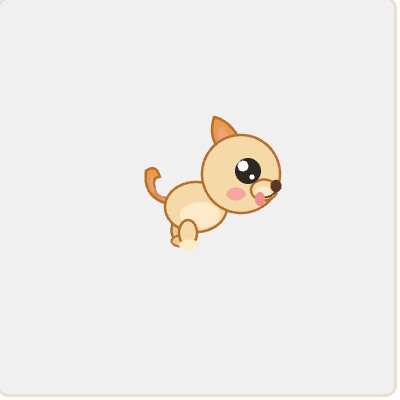
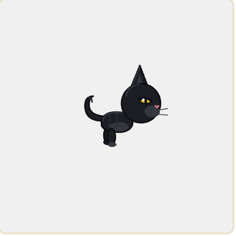
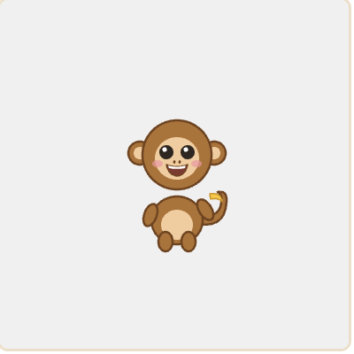
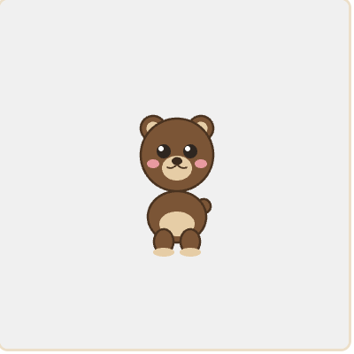
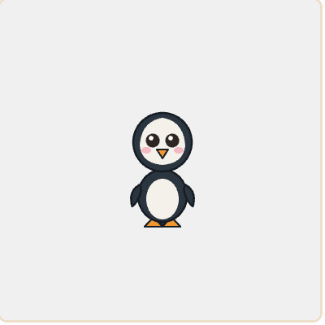
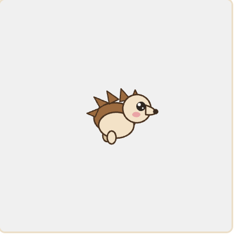
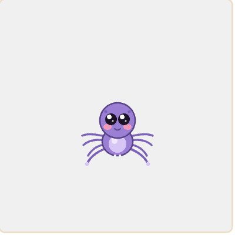
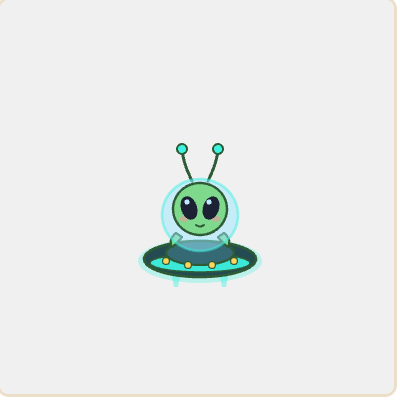
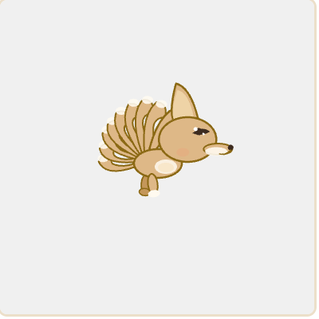

# 🐾 우다다 캐릭터 가이드

귀여운 동물들이 원형 트랙을 달려 순위를 정하는 경주 추첨 게임!
누가 1등 할지는 아무도 몰라 — 스킬 한 방에 순위가 뒤집힙니다. 🏁
각 동물은 발동하는 **스킬** 하나와, 입력 없이 늘 작동하는 **패시브** 하나를 가지고 있어요.

> **📏 직선 / 🔄 코너링:** 각 동물은 직선 구간과 코너(곡선) 구간 성향이 달라요. 직선이 강하면 코너링이 약하고 그 반대도 마찬가지 — 거리 가중으로 한 바퀴 합이 같아서 **누구도 일방적으로 유리하지 않은 공정한** 추첨이 유지됩니다.

---

## 한눈에 보기

| | 동물 | 한 줄 소개 | 스킬 | 📏 직선 | 🔄 코너링 |
|---|---|---|---|---|---|
| 🐶 | **강아지** | 이유 없이 폭주하는 산만함의 화신 | 우다다 (갑자기 폭주) | ⭐⭐⭐⭐⭐ | ⭐ |
| 🐱 | **고양이** | 방해를 사뿐히 피하는 얄미운 추월자 | 캣워크 (확률 회피) | ⭐⭐ | ⭐⭐⭐⭐ |
| 🐒 | **원숭이** | 바나나로 콕 집어 미끄러뜨리는 장난꾸러기 | 바나나 (저격 방해) | ⭐⭐⭐ | ⭐⭐⭐ |
| 🐻 | **곰** | 포효 한 방에 주변을 다 같이 움찔 | 포효 (광역 스턴) | ⭐⭐⭐⭐ | ⭐⭐ |
| 🐧 | **펭귄** | 앞에 빙판을 깔아 남을 미끄러뜨리는 전략가 | 빙판 (지역 감속) | ⭐⭐⭐⭐ | ⭐⭐ |
| 🦔 | **고슴도치** | 가시로 추격자를 톡 밀어내는 까칠 방어가 | 가시 (반동 카운터) | ⭐ | ⭐⭐⭐⭐⭐ |
| 🕷️ | **거미** | 거미줄로 선두를 콱 끌어내리는 끈적이 | 거미줄 (위치 강등·속박) | ⭐ | ⭐⭐⭐⭐⭐ |
| 👽 | **외계인** | 옆 동물 스킬을 스캔해 베껴 쓰는 변칙가 | 의태 (스킬 카피) | ⭐⭐⭐ | ⭐⭐⭐ |
| 🦊 | **구미호** | 날렵한 급선회로 코너를 씹어먹는 책략가 | 분신 (환영 속임수) | ⭐⭐ | ⭐⭐⭐⭐ |

---

## 🐶 강아지

이유 없이 폭주하는 산만함의 화신. 게임의 마스코트예요. 옆으로 새기도 하고 질주하기도 하는, 종잡을 수 없는 에너지 덩어리.

| 📏 직선 | 🔄 코너링 |
|---|---|
| ⭐⭐⭐⭐⭐ (최강) | ⭐ (취약) |

**스킬 — 우다다**

발동하면 통제 불능 폭주 모드! 앞으로 확 치고 나가는데, 운이 나쁘면 흥분해서 옆 레인으로 새기도 해요. 쿨다운은 약 3~6초. 직선 구간에서 발동하면 엄청난 거리를 먹습니다.

**패시브 — 스턴 떨치기**

바나나·포효·아이템에 멈춰 세워져도 **남들보다 빨리 툭툭 털고 일어나요**. 산만한 만큼 회복도 빨라서 스턴 시간이 절반으로 줄어듭니다. 폭주견은 한자리에 오래 못 있죠!

> 💡 한 방이 강력해요. 운만 따라주면 누구보다 빨리 치고 나갑니다.

---

## 🐱 고양이

방해 따윈 냐옹 하고 피해버리는 얄미운 추월자. 사뿐사뿐 달리며 코너마다 칼같이 파고들어요.

| 📏 직선 | 🔄 코너링 |
|---|---|
| ⭐⭐ | ⭐⭐⭐⭐ |

**스킬 — 캣워크**

능동 발동이 아닌 **반응형** 스킬이에요. 바나나·포효·거미줄 같은 방해가 날아올 때 쿨다운이 준비됐으면 **확률적으로 튕겨내고** 살짝 앞으로 미끄러져요. 빙판 위에서도 점프해 넘어갈 수 있어요. 완전 무적은 아니라 운이 따라야 합니다.

**패시브 — 코너 탈출 가속**

곡선을 빠져나와 직선에 들어서는 **바로 그 순간 짧게 확 튀어나가요**. 사뿐한 발놀림으로 코너 출구에서 한 발 앞서는 얄미운 가속. 코너링이 강한 고양이와 찰떡이에요.

> 💡 공격력은 약해도 방해에 잘 안 당해요. 막판까지 살아남는 끈질긴 타입.

---

## 🐒 원숭이

장난기 폭발 트러블메이커. 앞이든 뒤든 가리지 않고 바나나를 집어던져요.

| 📏 직선 | 🔄 코너링 |
|---|---|
| ⭐⭐⭐ | ⭐⭐⭐ |

**스킬 — 바나나**

앞이나 뒤 중 하나를 무작위로 골라, 그쪽 가장 가까운 동물에게 바나나를 던져 **잠깐 멈춰 세워요**. 10% 확률로 헛던지기가 나오는 게 개그 포인트. 한 번 맞은 동물은 잠깐 면역이 생겨서 연달아 같은 표적을 때리긴 어려워요. 쿨다운 약 2.1~3.8초. 🍌

**패시브 — 아이템 잔머리**

아이템 박스를 먹으면 **상황에 맞게 바꿔 써요**. 1등일 땐 자기를 때릴 등껍질(🐢)을 방귀(💨)로, 추격 중일 땐 쓸모없는 방귀를 선두 저격 등껍질로 바꿔요. 가끔(약 40%) 번개(⚡)를 무적 별(🌟)로 바꾸기도! 손재주 좋은 장난꾸러기답죠.

> 💡 선두를 콕 집어 견제하는 맛. 1등을 끌어내리는 데 최고예요.

---

## 🐻 곰

묵직한 산의 왕. 우직하게 직선을 달리는 탱커예요. 스킬도 강하지만 몸 자체도 무기입니다.

| 📏 직선 | 🔄 코너링 |
|---|---|
| ⭐⭐⭐⭐ | ⭐⭐ |

**스킬 — 포효**

"크아앙!" 한 방에 **주변 동물들을 다 같이** 잠깐 움찔하게 만들어요. 한 명이 아니라 근처 여럿을 동시에 묶는 광역기. 쿨다운 약 3~5.2초.

**패시브 — 몸통 밀치기**

스킬 없이도 바로 앞 동물과 같은 레인에 딱 붙으면 **자동으로 옆으로 밀어버려요**. 기술도 아니고 그냥 몸집으로 밀어내는 순수 몸통박치기. 달리는 내내 계속 발동해서 팩이 꽉 찼을 때 진가를 발휘해요.

> 💡 무리에 둘러싸였을 때 진가 발휘. 포효로 여러 명을 동시에 멈추고, 몸으로도 계속 밀어냅니다.

---

## 🐧 펭귄

뒤뚱뒤뚱 앞에 빙판을 까는 얄미운 전략가. 직선엔 강하지만 코너에서 미끄러지듯 둔해져요.

| 📏 직선 | 🔄 코너링 |
|---|---|
| ⭐⭐⭐⭐ | ⭐⭐ |

**스킬 — 빙판**

자기 앞쪽 길에 **빙판을 쫙** 깔아요. 그 위를 지나는 다른 동물들은 미끄러져 느려지지만, **펭귄은 오히려 쌩쌩** 미끄러져요. 빙판은 약 2.8초간 유지돼요. 쿨다운 약 5~8초. ⛸️

**패시브 — 막판 스퍼트**

혹독한 극지에서 단련된 지구력의 소유자! 앞에 빙판을 깔며 견제하다가도, **마지막 바퀴 마지막 코너를 빠져나오는 순간** 숨겨둔 스태미너로 막판 스퍼트를 터뜨려요. 그 짧은 결승 직선만큼은 **그 빠른 강아지보다도 빠릅니다**. 결승선 직전 대역전의 주인공.

> 💡 길목을 막는 지역 견제형. 뒤따라오는 추격자를 빙판으로 늪에 빠뜨려요.

---

## 🦔 고슴도치

붙지 마, 진짜. 작은 몸으로 코너를 무서운 속도로 파고드는 까칠 방어가예요.

| 📏 직선 | 🔄 코너링 |
|---|---|
| ⭐ | ⭐⭐⭐⭐⭐ (최강) |

**스킬 — 가시**

자동 발동이에요. 누군가 **바로 앞에서 추월하는 순간**, 75% 확률로 가시를 확 세워 그 동물을 뒤로 밀어내고 잠깐 느리게 만들어요. 그 반동으로 본인은 살짝 앞으로 튀어나가죠. 쿨다운 약 1.5~2.5초. 🦔

**패시브 — 작은 표적**

작고 낮아서 **조준하기가 어려워요**. 바나나·거미줄·등껍질 같은 원거리 공격이 약 30% 확률로 **빗나갑니다**. 까칠한 데다 잘 맞지도 않는 얄미운 방어가.

> 💡 뒤에 바짝 붙는 추격자를 카운터로 견제. 코너 구간에서 특히 빛납니다.

---

## 🕷️ 거미

거기 서! 거미줄로 콱! 직선에서 뒤처져도 코너에서 확 잡아당겨요.

| 📏 직선 | 🔄 코너링 |
|---|---|
| ⭐ | ⭐⭐⭐⭐⭐ (최강) |

**스킬 — 거미줄**

앞서가는 동물 하나를 거미줄로 낚아채 **자기 등 뒤로 끌어내리고**(위치 강등), 거미줄에 묶어 잠깐 끈적하게 느리게 만들어요. 멀리 던지지 않고 자기 바로 뒤에 바짝 붙여 끌어당기는 게 포인트. 한 번 잡힌 동물은 잠깐 면역이 생겨요. 쿨다운 약 2.6~4.2초. 🕸️

**패시브 — 벽타기**

어디든 척척 붙는 거미라서, **곡선에서 바깥으로 크게 돌아도 거리 손해가 적어요**. 보통은 코너에서 바깥 레인으로 가면 길이 길어져 손해인데, 거미는 벽을 타듯 그 손해가 절반. 코너 추월 라인이 자유로워요. 🕸️

> 💡 선두를 콕 집어 자기 뒤로 끌어내리는 위치 강등형. 1등을 통째로 주저앉힙니다.

---

## 👽 외계인

스캔 완료… 카피한다! UFO를 타고 지상에서 붕 떠서 달려요. 빙판 같은 지상 함정은 그냥 통과해요.

| 📏 직선 | 🔄 코너링 |
|---|---|
| ⭐⭐⭐ | ⭐⭐⭐ |

**스킬 — 의태**

근처에서 가장 가까운 동물을 스캔해 **그 동물의 스킬을 그대로 베껴** 발동해요. 바나나든 포효든 거미줄이든, 누구를 스캔했느냐에 따라 효과가 매번 달라지는 와일드카드. 주변에 아무도 없거나 베낄 수 없는 스킬이면 헛스캔(개그). 쿨다운 약 4~5.5초. 🛸

**패시브 — UFO 비행**

UFO를 타고 지면 위를 **붕 떠서** 날아요. 빙판 같은 지상 함정은 발이 안 닿으니 그냥 통과! 게다가 UFO는 **방음이 완벽**해서, 곰이 아무리 크게 포효해도 외계인한텐 안 들려요 — 그래서 포효 스턴도 무효예요. 단, 바나나·거미줄처럼 콕 집어 날아오는 건 UFO도 못 피해요. 🛸

> 💡 정해진 효과가 없는 변수 그 자체. 어떤 스킬이 튀어나올지 본인도 몰라요.

---

## 🦊 구미호

진짜인지 가짜인지 헷갈리게 만드는 책략가. 날렵하게 코너를 씹어먹어요.

| 📏 직선 | 🔄 코너링 |
|---|---|
| ⭐⭐ | ⭐⭐⭐⭐ |

**스킬 — 분신**

분신 2개를 만들어 앞뒤로 바짝 붙여놔요. 분신에 **부딪히는 동물은 잠깐 멈춰** 서고, 분신은 자신을 향한 방해를 대신 흡수하기도 해요. 약 3초 후 분신이 사라질 때, 앞 분신이 자기보다 앞에 있으면 **그 위치로 순간이동**해요. 진짜가 어딨는지 헷갈리는 게 포인트. 쿨다운 약 5~7초.

**패시브 — 빠른 출발**

출발 신호와 함께 **남들보다 1초 먼저 튀어나가요**. 다른 동물들이 아직 출발선에 있을 때 구미호는 이미 달리는 중! 초반 헤드스타트로 앞서 나가는 책략가의 잔꾀.

> 💡 코너에서 유독 강해요. 직선에서 뒤처져도 코너마다 만회하고, 분신으로 방해를 한 번 막아냅니다.

---

*이미지는 실제 게임 렌더러에서 캡처한 모습입니다. 동물·스킬은 계속 추가·조정될 수 있어요.*
